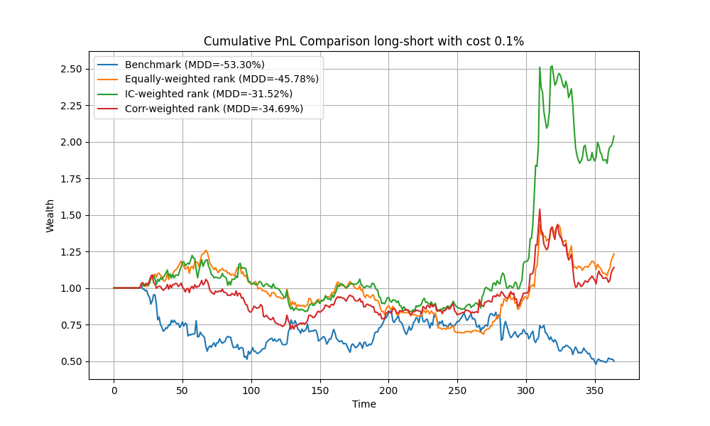

# 101-alphas-in-cryptocurrency-market
**Project type:** Quantitative Finance — Alphas engineering, Backtesting & Risk Analysis  
**Languages/Libs:** Python, NumPy, pandas, matplotlib

## Summary
This project presents the development and evaluation of quantitative trading strategies in the cryptocurrency market based on the WorldQuant 101 Alphas framework. A subset of alphas was selected and analyzed from the orinigal paper, due to their Information coefficient (IC) and turnover rate, and multiple weak alphas were combined into composite “super alphas” using several aggregation methods, including equal weighting, IC-based weighting, and inverse-correlation weighting. Portfolio strategies were constructed based on these super alphas under various configurations (long-short and long-only, with and without transaction costs). Such portfolio metrics like the annualized sharpe ratio and the cumulative pnl were calculated and compared with the Benchmark.
## Features

- Crypto data preprocessing and cleaning
- Alpha related functions engineering
  - Returns (incl. normal and log)
  - Average Daily Volume (ADV)
  - Volume-Weighted Average Price (VWAP)
  - Rolling covariance and correlations
- Alphas implementation
- Alpha evaluations
  - Information coefficient (IC): mean, std, t-statistics
  - turnover rate
  - positive ratio
  - rolling average
- Weak alphas combining -> superalphas
  - equally weighted
  - IC weighted
  - correlation-inversion weighted
- Portfolio building
  - Sharpe Ratio
  - Maximum Drawdown
  - Cumulative pnl

# Project Structure
```
├── src/              # Core logic (strategies, metrics, etc.)
  ├── data/           # Data loading and data cleanness
  ├── metrics/        # All the metrics used in evalutating alphas, superalphas and portfolios
  ├── portfolios/     # Building portfolios based on alpha results
  ├── raw_alphas/     # Implementation of alphas, classfied by their economic intuitions (mean-reversion, momentum, Market-microstructure, volatility, volume-price)
  ├── super_alphas/   # Methods to combine raw alphas
  ├── visualizations/ # All visualization tools
├── data/             # Data, as csv file
├── notebooks/        # Bug-free version jupyter notebook
├── results/          # Output plots / reports
├── main.py           # Entry point
├── requirements.txt
```
## Installation

```bash
pip install -r requirements.txt
```
## Data
The pricing datasets using here come from the website cryptodatadownload.com/, a free and open-source platform for accessing historical cryptocurrency market data. Specifically, we select Binance as the trading venue and utilize daily OHLCV (Open, High, Low, Close, Volume) data for a broad universe of cryptocurrencies (43 coins), containing different types of coins like Layer 1, DeFi tokens and Exchange tokens, to ensure diversity.

PLEASE place them in the `data/raw` folder BEFORE running the code!


## Sample visual results
Alpha-level evaluation (t-statistics of Information coefficients)


Portfolio-level evaluation (cumulative pnl & maximum drawdown)



## Conclusions
This project investigates the applicability of the WorldQuant 101 Alphas framework in the cryptocurrency market and demonstrates that, although individual alphas often suffer from weak out-of-sample performance, their combination into well-constructed super-alphas can significantly improve robustness and predictive power.
Through careful alpha selection based on IC t-statistics, rank normalization, and diversified weighting schemes, we construct composite signals that exhibit stable performance across different market regimes. Empirical results show that these super-alpha-based portfolios consistently outperform a benchmark equal-weighted strategy in both in-sample and out-of-sample periods. Notably, the IC-weighted super-alpha achieves strong risk-adjusted returns, with Sharpe ratios remaining robust even after accounting for transaction costs.
From a risk perspective, the strategies demonstrate improved drawdown characteristics compared to the benchmark, highlighting the benefit of diversification across multiple signals. Overall, the findings confirm that combining multiple weak but complementary signals is an effective approach to building scalable and resilient quantitative strategies in the highly volatile cryptocurrency market.


## Complete notebook files and results
- `notebooks/101_alphas_in_crypto.ipynb` — cleaned notebook ready for GitHub.
- `results/Report.pdf` — full PDF report with figures and results.


